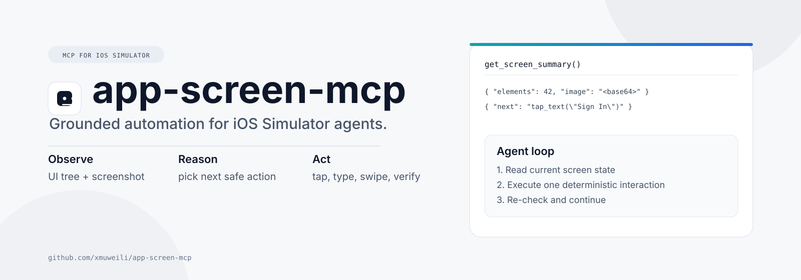

<div align="center">
  

  <h1>app-screen-mcp</h1>
  <p><strong>MCP server for reliable iOS Simulator automation.</strong></p>
  <p>
    Control simulators, read accessibility UI trees, capture screenshots,
    and run grounded agent actions through one
    <a href="https://modelcontextprotocol.io">Model Context Protocol</a> server.
  </p>

  <p>
    
    
    
    
  </p>
</div>

## Why this exists

Most mobile automation breaks when scripts act without observing current screen state.

`app-screen-mcp` fixes that by combining:
- Accessibility structure from `idb ui describe-all`
- Real pixels from Simulator screenshots
- Deterministic interactions (`tap`, `type_text`, `swipe`, hardware buttons)

This gives agents a closed loop: observe, reason, act, verify.

## What you get

- Simulator discovery and boot control
- App launch and termination by bundle ID
- Full normalized accessibility tree
- JPEG screenshots with size/quality controls
- Image-hash suppression to skip unchanged screenshots
- Semantic actions by text or accessibility ID
- Relative-coordinate taps for resolution-independent flows
- One-call screen summary (`UI tree + optional screenshot`)

## Architecture

```text
MCP Client / Agent
        |
        v
   app-screen-mcp
        |
        +--> xcrun simctl (devices, app lifecycle, screenshots)
        |
        +--> idb (UI tree, tap, swipe, type, hardware buttons)
        |
        v
   iOS Simulator
```

## Prerequisites

- macOS with Xcode + iOS Simulator
- Node.js 18+
- `idb` tooling

Manual install for `idb`:

```bash
brew tap facebook/fb
brew install idb-companion
pip3 install fb-idb
```

## Install

### Option 1: one-step installer (recommended)

```bash
bash <(curl -fsSL https://raw.githubusercontent.com/xmuweili/app-screen-mcp/main/install.sh)
```

The script checks/installs:
- Xcode Command Line Tools
- Homebrew
- Node.js (18+)
- `idb-companion`
- `fb-idb`
- `app-screen-mcp` (global npm package)

### Option 2: global npm install

```bash
npm install -g app-screen-mcp
```

### Option 3: from source

```bash
git clone https://github.com/xmuweili/app-screen-mcp.git
cd app-screen-mcp
npm install
npm run build
```

## Configure your MCP client

### Claude Desktop

Config file:
`~/Library/Application Support/Claude/claude_desktop_config.json`

```json
{
  "mcpServers": {
    "ios-simulator": {
      "command": "node",
      "args": ["/absolute/path/to/app-screen-mcp/dist/index.js"]
    }
  }
}
```

### Cursor / VS Code MCP

Common config paths:
- `.cursor/mcp.json`
- `.vscode/mcp.json`

Use the key your client expects: `mcpServers` or `mcp.servers`.

```json
{
  "mcpServers": {
    "ios-simulator": {
      "command": "node",
      "args": ["/absolute/path/to/app-screen-mcp/dist/index.js"]
    }
  }
}
```

Restart your MCP client after updating config.

## Tool reference (15 tools)

| Tool | Purpose |
|---|---|
| `list_simulators` | List simulators and boot state |
| `boot_simulator` | Boot simulator by UDID |
| `launch_app` | Launch app by `bundle_id` |
| `terminate_app` | Force-quit app by `bundle_id` |
| `get_ui_tree` | Return normalized accessibility tree |
| `take_screenshot` | Capture JPEG screenshot with compression and unchanged-image suppression |
| `get_screen_summary` | Return tree + optional screenshot with token-saving options |
| `tap` | Tap absolute `(x, y)` |
| `tap_relative` | Tap relative `(rx, ry)` in `[0,1]` |
| `type_text` | Type into focused field |
| `swipe` | Swipe between points with optional duration |
| `press_button` | Press `HOME`, `LOCK`, `SIDE_BUTTON`, or `SIRI` |
| `find_elements` | Search tree by label/value/hint text |
| `tap_text` | Find best text match and tap target point |
| `tap_id` | Tap by accessibility identifier |

## Quick usage patterns

### 1) Observe without image (cheap)

```json
{
  "name": "get_screen_summary",
  "arguments": {
    "include_image": false,
    "compact_tree": true
  }
}
```

### 2) Add image when visual confirmation is required

```json
{
  "name": "get_screen_summary",
  "arguments": {
    "include_image": true,
    "max_dim": 720,
    "quality": 55
  }
}
```

### 3) Skip unchanged screenshots

```json
{
  "name": "get_screen_summary",
  "arguments": {
    "include_image": true,
    "only_if_changed": true,
    "previous_image_hash": "<last_hash>"
  }
}
```

### 4) Stable interaction flow

```text
1. get_screen_summary(include_image=false)
2. find_elements("Sign In")
3. tap_id("login_email") or tap_text("Email")
4. type_text("user@example.com")
5. tap_text("Sign In")
6. get_screen_summary(include_image=true, only_if_changed=true)
```

## Permission prompts

Permission behavior is enforced by the MCP client, not this server.

### Claude Code (CLI)

Allow this server in `~/.claude/settings.json`:

```json
{
  "permissions": {
    "allow": ["mcp__ios-simulator__*"]
  }
}
```

`ios-simulator` must match your MCP server name.

### Codex CLI

Codex uses command-level approvals. Use “always allow” for recurring safe command prefixes when prompted.

## Local development

```bash
npm install
npm run build
npm start
```

Main implementation:
- `src/index.ts`

## Testing

The integration tests run against a real booted iOS Simulator.

```bash
npm test
```

Before running tests:
- Boot an iOS Simulator device.
- Build/install demo app under `demo-app/` if not already installed.

Test helpers:
- `tests/helpers/client.ts`
- `tests/helpers/ui.ts`
- `tests/helpers/vision.ts`

## Troubleshooting

- `No iOS simulator is currently running`
  - Boot a simulator first, or call `boot_simulator`.
- `idb` command failures
  - Verify `idb-companion` and `fb-idb` installation and PATH.
- Missing/weak element matches
  - Improve app accessibility labels and identifiers.
- GUI client cannot find node/module path
  - Use an absolute path in `args` instead of relying on shell PATH.

## Contributing

Contributions are welcome.

For tool changes:
- Update tool schema in `src/index.ts`
- Implement tool handler in `src/index.ts`
- Add integration coverage in `tests/demo-app.test.ts`
- Update Tool Reference in this README

## License

MIT
